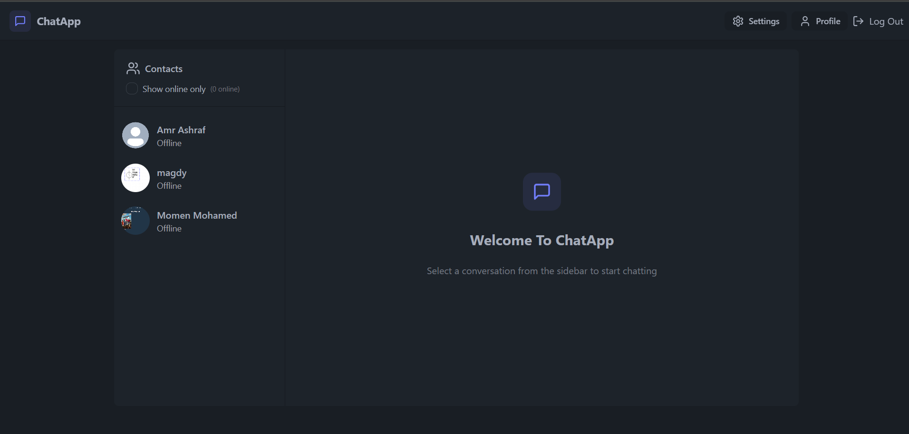
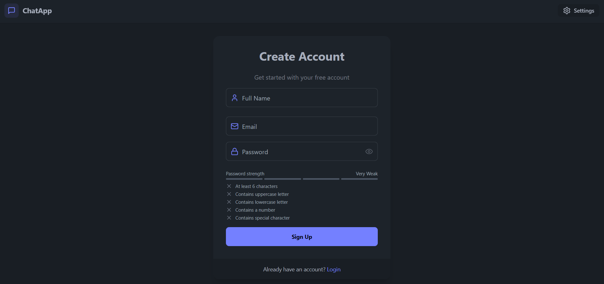
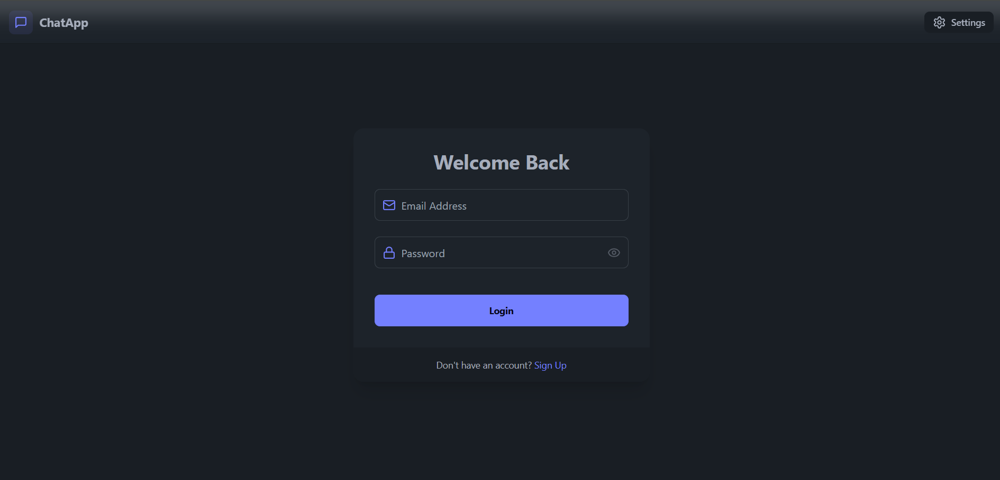

# 📝 ChatApp – MERN ChatApp

A sleek, full-stack note-taking application built with MongoDB, Express, React, and Node.js. ZenNote offers a friendly interface for creating, reading, updating, and deleting notes seamlessly.

<!---->
<p align="center">
  
  
  
</p>

---

## 📋 Table of Contents

- [Overview](#-overview)  
- [Features](#-features)  
- [Technologies](#-technologies)
- [API Usage](#-api-usage)
- [Project Structure](#-project-structure)   
- [Installation](#-installation)
- [Contact](#-contact)  

---
## 📖 Overview

A full-stack real-time chat application built with MERN, Socket.io, TailwindCSS, and Zustand. Features include JWT authentication, real-time messaging, online user tracking, global state management, and full error handling. Deployed for free with professional setup.

- **Express.js** backend with MongoDB via Mongoose  
- **React** frontend styled with Tailwind CSS (DaisyUI)  
- Full RESTful API with rate-limiting and toast notifications  

---
## Features
- 🌟 Tech stack: MERN + Socket.io + TailwindCSS + Daisy UI
- 🎃 Authentication && Authorization with JWT
- 👾 Real-time messaging with Socket.io
- 🚀 Online user status (Socket.io and React Context)
- 👌 Global state management with Zustand
- 🐞 Error handling both on the server and on the client

---

## 🛠 Technologies

-   
-   
-   
-   
-   
-   
-   
-   
-   
-   
-   
-   
- 

---
## 📘 API Endpoints

### 🔐 Authentication Routes

| Method | Endpoint          | Description                      | Protected | Controller Function |
|--------|-------------------|----------------------------------|-----------|---------------------|
| POST   | `/signup`         | Register a new user              | No        | `signup`            |
| POST   | `/login`          | Log in an existing user          | No        | `login`             |
| POST   | `/logout`         | Log out the current user         | No        | `logout`            |
| PUT    | `/update-profile` | Update the user profile          | Yes       | `updateProfile`     |
| GET    | `/check`          | Check user authentication status | Yes       | `checkAuth`         |

### 💬 Messaging Routes

| Method | Endpoint       | Description                              | Protected | Controller Function    |
|--------|----------------|------------------------------------------|-----------|------------------------|
| GET    | `/users`       | Get users for sidebar display            | Yes       | `getUsersForSidebar`   |
| GET    | `/:id`         | Get messages for conversation with user  | Yes       | `getMessages`          |
| POST   | `/send/:id`    | Send a message to a user by ID           | Yes       | `sendMessage`          |

---

## 🧭 Project Structure
```C++
MERN-CHATAPP/
├── backend/
│ ├── node_modules/
│ ├── src/
│ │ ├── controllers/
│ │ ├── lib/
│ │ ├── middleware/
│ │ ├── models/
│ │ └── server.js
│ ├── .env
│ ├── package.json
│ └── package-lock.json
├── frontend/
│ ├── node_modules/
│ ├── public/
│ └── src/
│ ├── assets/
│ ├── components/
│ ├── constants/
│ ├── lib/
│ ├── pages/
│ ├── store/
│ ├── App.jsx
│ ├── index.css
│ └── main.jsx
├── .gitignore
```
---

## ⚙️ Installation

### 1. Clone the Repository
   ```sh
   git clone https://github.com/amrashraf15/MERN-AUTH.git
    cd MERN-AUTH
   ```
2. Install Backend Dependencies
   ```sh
   cd backend
    npm install
   ```
3. Set Up Environment Variables
   ```js
     PORT=5001
    MONGODB_URI=....
    JWT_SECRET=.....
    NODE_ENV=development
    CLOUDINARY_CLOUD_NAME=.......
    CLOUDINARY_API_KEY=......
    CLOUDINARY_API_SECRET=....
   
   ```
4. Start the Backend Server
   ```sh
   npm run start
    # Runs on http://localhost:5001
   ```
   
 5. Install Frontend Dependencies
     ```sh
       cd ../frontend
        npm install
      ```
---
 ## 📬 Contact

- **Name**: Amr Ashraf  
- **Email**: [amrashraf1592@gmail.com](mailto:amrashraf1592@gmail.com)  
- **GitHub**: [amrashraf15](https://github.com/amrashraf15)  
- **Project Link**: [MERN-AUTH](https://github.com/amrashraf15/MERN-AUTH)

---


